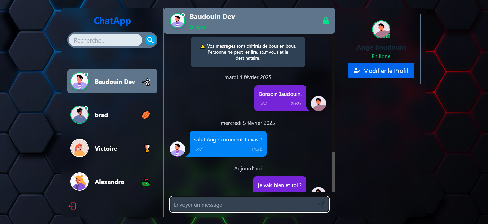
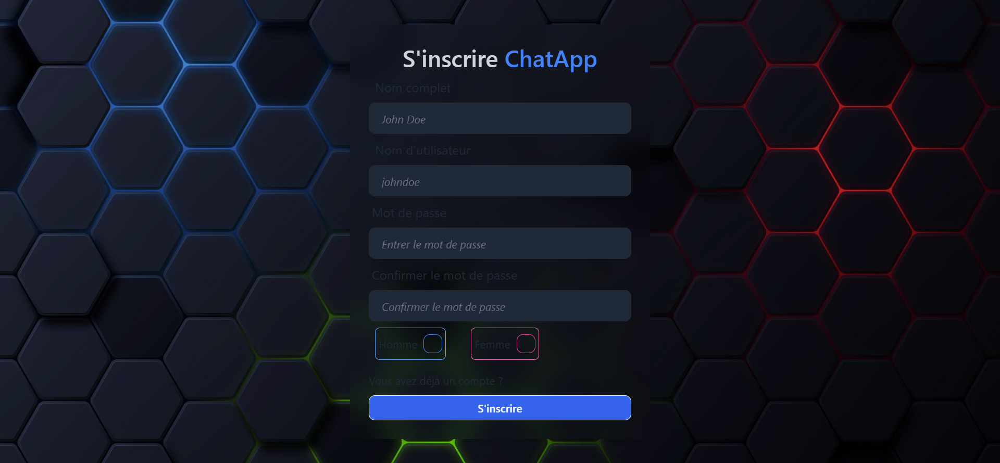

# Chat-App Project: Build and Deploy a Real Time Chat App | JWT, Socket.io



### Directory structure:
└── boris913-chat-app/
    ├── README.md
    ├── LICENSE
    ├── package.json
    ├── backend/
    │   ├── server.js
    │   ├── controllers/
    │   │   ├── auth.controller.js
    │   │   ├── message.controller.js
    │   │   └── user.controller.js
    │   ├── db/
    │   │   └── connectToMongoDB.js
    │   ├── middleware/
    │   │   └── protectRoute.js
    │   ├── models/
    │   │   ├── conversation.model.js
    │   │   ├── message.model.js
    │   │   └── user.model.js
    │   ├── routes/
    │   │   ├── auth.routes.js
    │   │   ├── message.routes.js
    │   │   └── user.routes.js
    │   ├── socket/
    │   │   └── socket.js
    │   └── utils/
    │       └── generateToken.js
    └── frontend/
        ├── README.md
        ├── index.html
        ├── package-lock.json
        ├── package.json
        ├── postcss.config.js
        ├── tailwind.config.js
        ├── vite.config.js
        ├── .eslintrc.cjs
        ├── public/
        └── src/
            ├── App.css
            ├── App.jsx
            ├── index.css
            ├── main.jsx
            ├── assets/
            │   ├── ChatApp.PNG
            │   └── sounds/
            ├── components/
            │   ├── messages/
            │   │   ├── Message.jsx
            │   │   ├── MessageContainer.jsx
            │   │   ├── MessageInput.jsx
            │   │   └── Messages.jsx
            │   ├── sidebar/
            │   │   ├── Conversation.jsx
            │   │   ├── Conversations.jsx
            │   │   ├── LogoutButton.jsx
            │   │   ├── SearchInput.jsx
            │   │   └── Sidebar.jsx
            │   ├── sidebar-right/
            │   │   ├── EditProfileModal.jsx
            │   │   └── UserProfile.jsx
            │   └── skeletons/
            │       └── MessageSkeleton.jsx
            ├── context/
            │   ├── AuthContext.jsx
            │   └── SocketContext.jsx
            ├── hooks/
            │   ├── useGetConversations.js
            │   ├── useGetMessages.js
            │   ├── useListenMessages.js
            │   ├── useLogin.js
            │   ├── useLogout.js
            │   ├── useSendMessage.js
            │   └── useSignup.js
            ├── pages/
            │   ├── home/
            │   │   └── Home.jsx
            │   ├── login/
            │   │   └── Login.jsx
            │   └── signup/
            │       ├── GenderCheckbox.jsx
            │       └── SignUp.jsx
            ├── utils/
            │   ├── emojis.js
            │   └── extractTime.js
            └── zustand/
                └── useConversation.js
### Setup .env file

```js
PORT=...
MONGO_DB_URI=...
JWT_SECRET=...
NODE_ENV=...
```

### Build the app

```shell
npm run build
```

### Start the app

```shell
npm start
```
