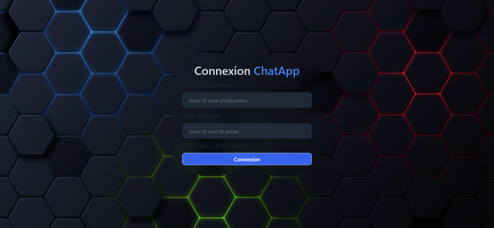

# Chat-App Project: Build and Deploy a Real Time Chat App | JWT, Socket.io



### Setup .env file

```js
PORT=...
MONGO_DB_URI=...
JWT_SECRET=...
NODE_ENV=...
```

### Build the app

```shell
npm run build
```

### Start the app

```shell
npm start
```
